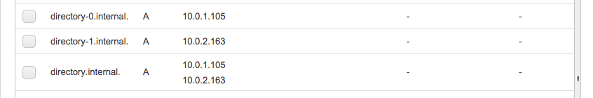

# Terraform AWS Directory testing

This makes a Simple Microsoft AD, and adds a couple of R53 entries as shown in the screenshot below. `directory` resolves to all the IP addresses of the directory and a `directory-N` entry is created for each of the IPs that the directory listens on. This is typically equal to the number of subnets you specify in `directoryt.tf`.

